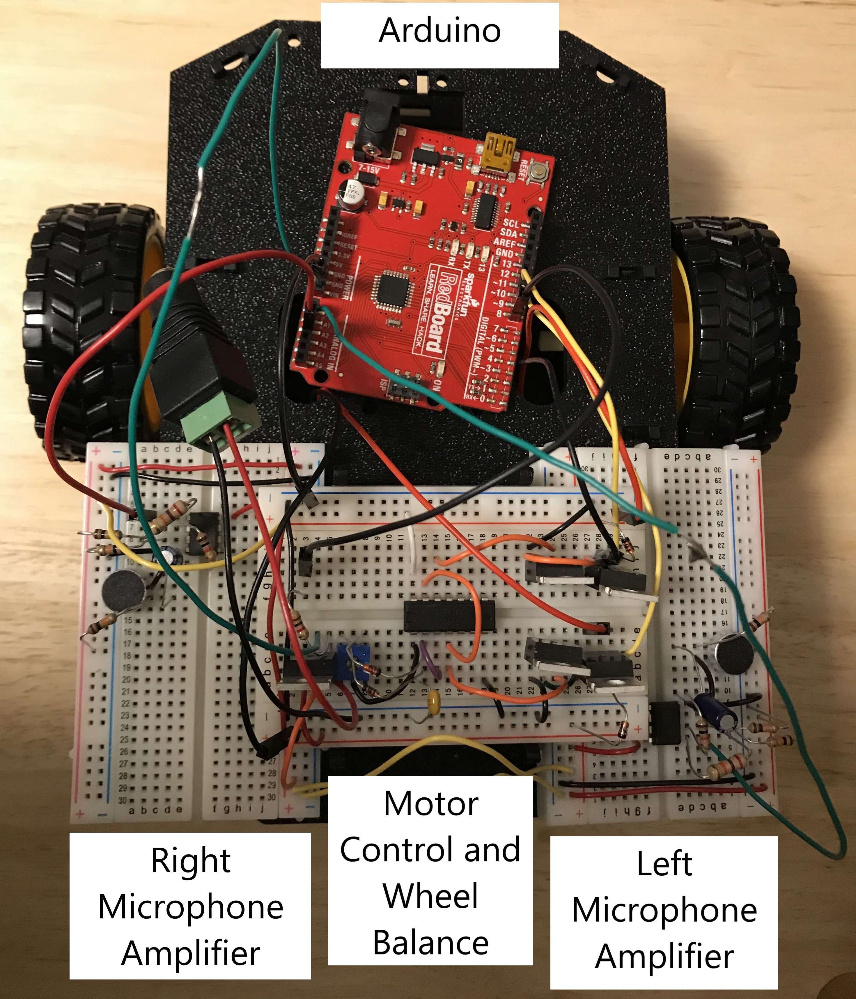

# Sound Following Vehicle - ECE 110 Final Project
Using a microphone array and amplifying circuit, motor control and wheel balance circuit, and Arduino to control a vehicle using a "clap" sound.

The project consists of having two microphones a left and right, each microphone has an op-amplifier circuit, and the sound collected from the microphone is used as analog input for the Arduino. The Arduino code will digitally rectify the voltage input from the microphone and compare which microphone had a higher voltage amplitude and will control the wheels to move in the sound direction. After figuring out which direction to move towards, the Arduino will input voltage into the motor control and wheel balance circuit to move vehicle for one second.
### Video [Link](https://youtu.be/4MHTfCoX1pg)

